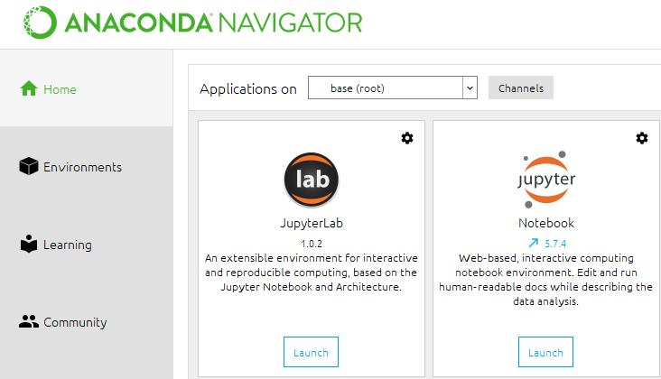

### How to install Julia

1. Download the binary file (**version 1.2 demonstrated here**)
   
   (Linux): https://julialang-s3.julialang.org/bin/linux/x64/1.2/julia-1.2.0-linux-x86_64.tar.gz
   

(Windows) https://julialang-s3.julialang.org/bin/winnt/x64/1.2/julia-1.2.0-win64.exe

   (Mac) https://julialang-s3.julialang.org/bin/mac/x64/1.2/julia-1.2.0-mac64.dmg

2. Untar / install

3. Run (e.g. Linux)

   ``` bash
   linlin@forum:~/.julia/environments$ julia
                  _
      _       _ _(_)_     |  Documentation: https://docs.julialang.org
     (_)     | (_) (_)    |
      _ _   _| |_  __ _   |  Type "?" for help, "]?" for Pkg help.
     | | | | | | |/ _` |  |
     | | |_| | | | (_| |  |  Version 1.2.0 (2019-08-20)
    _/ |\__'_|_|_|\__'_|  |  Official https://julialang.org/ release
   |__/                   |
   
   julia>
   ```

   

### How to upgrade your local version of Julia (from 0.7+)

From version 0.7+, the package management system has changed.

```bash
linlin@forum:~$ cd ~/.julia/environments/
linlin@forum:~/.julia/environments$ ls
v0.7  v1.1
linlin@forum:~/.julia/environments$ cp -r v0.7 v1.2
linlin@forum:~/.julia/environments$ julia
               _
   _       _ _(_)_     |  Documentation: https://docs.julialang.org
  (_)     | (_) (_)    |
   _ _   _| |_  __ _   |  Type "?" for help, "]?" for Pkg help.
  | | | | | | |/ _` |  |
  | | |_| | | | (_| |  |  Version 1.2.0 (2019-08-20)
 _/ |\__'_|_|_|\__'_|  |  Official https://julialang.org/ release
|__/                   |

julia>
```

Now press ] to enter the package mode

```bash
(v1.2) pkg> update; precompile
  Updating registry at `~/.julia/registries/General`
  Updating git-repo `https://github.com/JuliaRegistries/General.git`
  Updating git-repo `https://github.com/JuliaPy/Conda.jl.git`
  Updating git-repo `https://github.com/JuliaLinearAlgebra/GenericLinearAlgebra.jl`
  Updating git-repo `https://github.com/JuliaPy/PyCall.jl.git`
  Updating git-repo `https://github.com/JuliaPy/PyPlot.jl.git`
 Resolving package versions...
 Installed Distances ────── v0.8.2
 Installed NLSolversBase ── v7.4.1
 Installed IJulia ───────── v1.20.0
 Installed MbedTLS ──────── v0.7.0
 Installed BandedMatrices ─ v0.10.1
 Installed DataFrames ───── v0.19.3
 Installed OrdinaryDiffEq ─ v5.15.0
...
```

Now your previously installed package should be ready to be used. For example, try `Arpack` (solving sparse eigenvalue problems)

```julia
using Arpack
using LinearAlgebra
A = Diagonal(1:4);
λ, ϕ = eigs(A, nev = 2);
display(λ)

2-element Array{Float64,1}:
 4.0
 3.0
```


Once you have installed Julia, [get started from here with the Julia documentation](https://docs.julialang.org/en/v1/manual/getting-started/) .


### Notebook mode of julia

First, you need to install the `IJulia` package from Julia.

Then, download the [Jupyter](https://jupyter.org/install) software. The classic Jupyter Notebook comes together with the `Anaconda` python distribution and is perhaps the easiest. In fact, `Anaconda` installs both Jupyter Notebook and Jupyter Lab:



Launch either JupyterLab or Jupyter Notebook, and you should be able to create a new IJulia notebook, with the version matching the version of Julia for which `IJulia` is installed. 

Another way to get access to the Jupyter lab is to use your browser, the default address http://localhost:xxxx/tree leads to the classic the notebook, and http://localhost:xxxx/lab leads to the Jupyter Lab.

You might also find it handy to have the cheat sheets for 

- [keyboard shortcuts for JupyterLab](https://raw.githubusercontent.com/Jakeler/jupyter-shortcuts/master/outputs/Shortcuts.png)
- [keyboard shortcuts for Jupyter Notebook](https://www.cheatography.com/weidadeyue/cheat-sheets/jupyter-notebook/)


### Console mode of julia

- Running a script

  ```julia
  include(“name.jl”)
  ```

- Different modes

  - **Command** mode
  - **Help** mode (type “?”)
  - **Shell** mode (type “;”)
  - **Package** mode (type “]”)

- Package mode:

  - Add a package: `]add packagename`
  - Update the package list: `]update` 
  - **Update and precompile** (otherwise the precompilation process will occur when you execute `using package` for the first time) :
     `]update; precompile`
  - Build a package (some packages need to be built before used): `]build packagename` 


### Julia packages used in this course (this list will keep updating throughout the course)

- `Plots/PyPlot/Gadfly`: Plotting: 

  Useful link https://julialang.org/downloads/plotting.html

- `IJulia`: Notebook (now in the Jupyter notebook)

- `DifferentialEquations`: See everything we will talk about in this class about ODEs. [http://docs.juliadiffeq.org](http://docs.juliadiffeq.org/)

- `LinearAlgebra`: Nearly all basic linear algebra related packages

- `SpecialFunctions`: Special functions such as Bessel, Hankel, Airy, error,etc.

- `Flux/DiffEqFlux`: Machine learning related packages


### If you have used Julia v0.6 (or earlier versions) but not v0.7+

First of all,  Julia v0.7 (released 08/2018, equivalent to v1.0 other than additional warning messages helping the transition) introduced many breaking changes. This will not be a problem if you start afresh, but may require you to adapt your old code to the new version. Here are a few tips that might help you with the transition.

- Always only refer to the latest manual

- The package mode has been changed. `Pkg.add("package name")` no longer works.  The new way is to type `]` which gives `|pkg>`

- `@printf` is deprecated.  Need to load the package `using Printf`

- Many linear algebra routines were moved from `Base` to `LinearAlgebra` package.

- `eye(N)` for identity matrix is deprecated.  Now it is `Matrix(1.0I,N,N)`.

- `diagm(vec,n)` to create a matrix with `vec` on its n-th sub-diagonal (if n=0 it is the diagonal) is      deprecated.  Now it is `diagm(n=>vec)`.

- Matrix functions such as `expm` and `logm` are deprecated. Now they can be invoked by `exp` and `log` directly. Note that this is very different behavior from `MATLAB`.

- Diagonalization routine `eig` is replaced by `eigen`

- `qr` does not return the QR factors `(q,r)`, but a structure.  So if `F=qr(A)` is called, `F.Q` and `F.R` are needed to retrieve the Q and R factors.

- `full(A)` is deprecated. Now it becomes `Matrix(A)`.

- Special functions such as `erf` are now in the `SpecialFunctions` package.

- In a local scope, such as a `for`-loop, global variables are only inherited for reading but not for      writing. For example

  ``` julia
  z = 1.0
  for i = 1 : 3
      # Only read the values of the global variable z
      println(z)
  end
  
  # output
  1.0
  1.0
  1.0
  ```

  However,

  ``` julia
  z = 1.0
  for i = 1 : 3
      # Also write to the global variable z
      z = z + i
  end
  
  # output 
  ERROR: UndefVarError: z not defined
  ```

  There are two ways getting around this problem.

  The first is to put an explicit `global` in front of the assignment

  ``` julia
  z = 1.0
  for i = 1 : 3
      # Also write to the global variable z
      global z = z + i
  end
  println(z)
  
  # output 
  7.0
  ```

  The second way is to wrap everything in a "global local scope" using a `let` block, or any other function or subroutine. Then the global variable becomes a local variable

  ``` julia
  z = 1.0
  let
      z = 1.0
      for i = 1 : 3
          z = z + i
      end
      println(z)
  end
  
  # output 
  7.0
  ```

  **Note (8/10/2019):** It appears that in the latest version of JupyterLab / Jupyter Notebook, **this problem is fixed**, i.e. you **can** modify the values of global variables in the **Notebook environment (only)**. I strongly agree with this modification, since it is rather annoying to put `let` blocks in a notebook everywhere which messes up with the indent. I guess the rationale for the very strict scoping rule is to discourage users from using global variables when writing production level codes (which I agree). The scope issue apparently went through [a hot debate](https://discourse.julialang.org/t/another-possible-solution-to-the-global-scope-debacle/15894), but I do not know whether a definitive answer has been reached at this point.


### Other materials

Here is a notebook introducing some basic features of Julia.

[Notebook: Julia tutorial](notebooks/Basics.ipynb) Last update: 8/28/2019

Here are a few other online documents.

[Learn X in Y minutes](https://learnxinyminutes.com/docs/julia/)

[The Julia Express (pdf)](http://bogumilkaminski.pl/files/julia_express.pdf)

[MATLAB–Python–Julia cheatsheet](https://cheatsheets.quantecon.org/)

[Julia user manual](https://docs.julialang.org/)